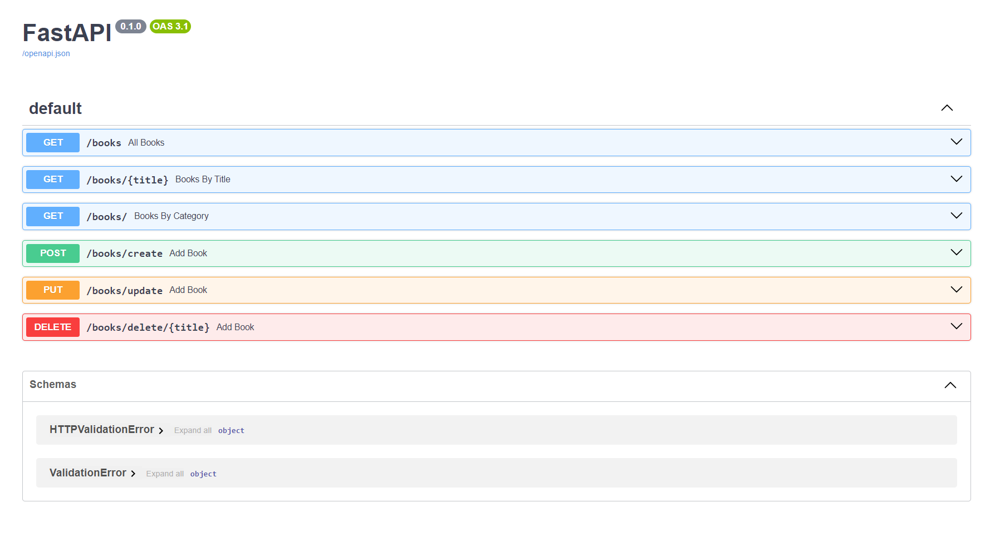

```shell
python -m vene fastapienv
.\fastapienv\Scripts\activate
pip install "unicorn[standard]"
```
Change python local interpreter from .\fastapienv\Scripts\python.exe

```shell
python -m uvicorn books:app --reload
```
### Access endpoints
http://localhost:8000/books/?title=HP1
```shell
curl --location --request POST 'localhost:8000/books/create' \
--header 'Content-Type: application/json' \
--data-raw ' {"title": "hp5", "author": "tester", "description": "asdfzxcvzxcv", "rating": 2}'
```

### More
[swagger](http://localhost:8000/docs)

